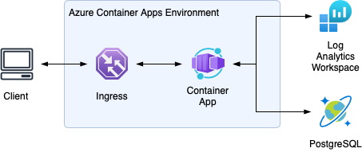

# Deploy infrastructure to Azure

Before running Terraform, you need to set up the Azure CLI and log in to your Azure account.



## Prerequisites

Make sure to check the `variables.tfvars` file to set the correct values for your environment.

## Deploy

Run the Terraform `plan` command to see what will be deployed:

```sh
terraform plan --out=plan.out
```

Then:

```sh
terraform apply plan.out
```